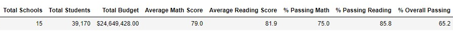
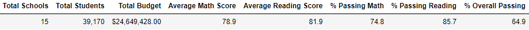
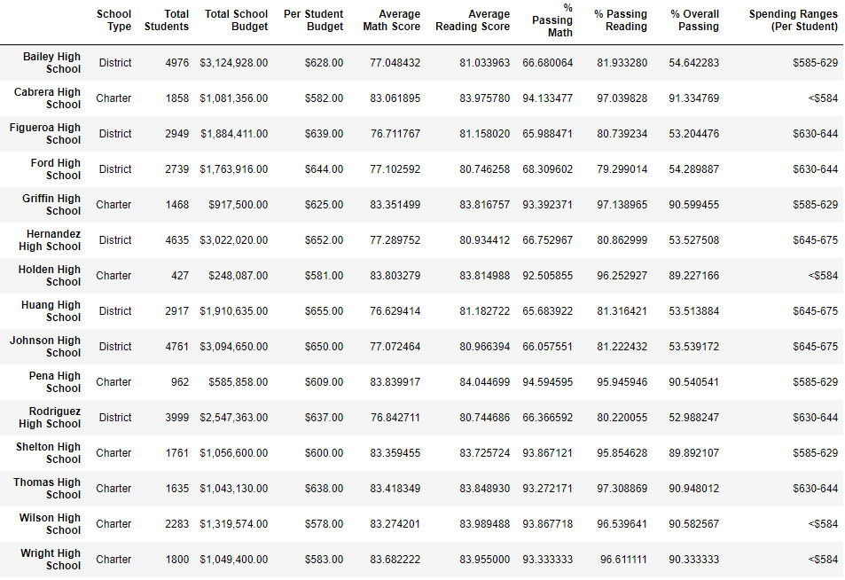
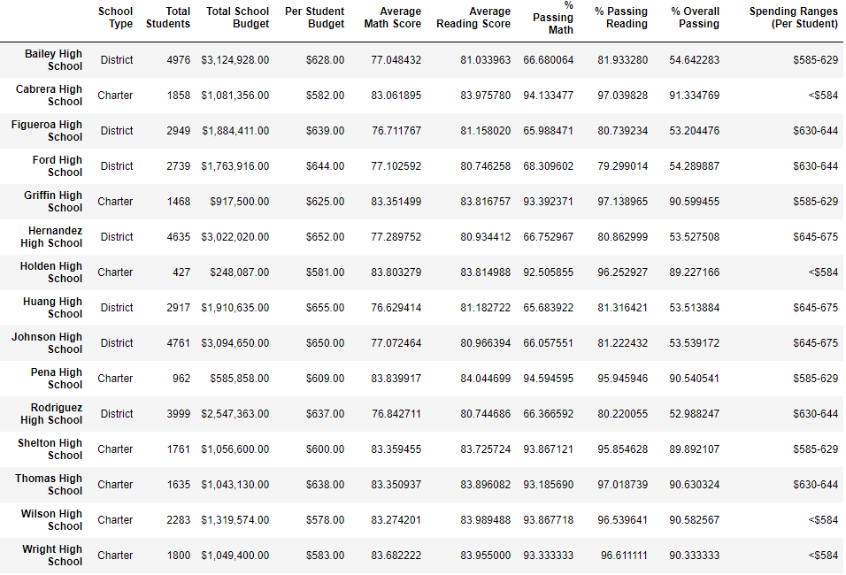
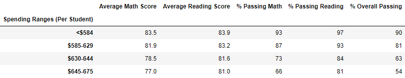
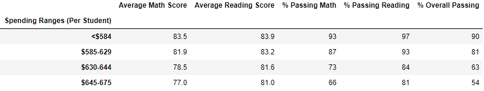
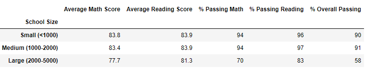
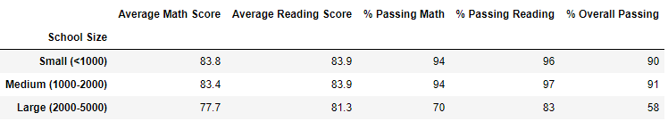
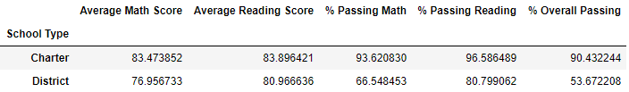
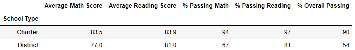

# School District Analysis

## Project Overview
Maria, the chief data scientist for a school district, tasked the analyst with aggregating student test score data and showcase trends in student performance. The results and summary of this task will be used by the school board and superintendent to make decisions regarding school budgets and spending. 

After some analysis, the school board discovered academic dishonesty amongst 9th graders at Thomas High School (THS). In order to uphold state-testing standards, the analyst has been tasked with replacing 9th grade test scores at THS with NaNs while keeping the rest of the data in tact. Then, the data analyst repeated the analysis to discover the impact of the dishonesty. 

## Resources
- Data Sources: [clean_students_complete.csv](https://github.com/r3ginam/School_District_Analysis/blob/main/Resources/clean_students_complete.csv), [schools_complete.csv](https://github.com/r3ginam/School_District_Analysis/blob/main/Resources/schools_complete.csv)
- Software: Python 3.9.1, Jupyter Notebook 6.0.3

## Results
* How is the district summary affected?
The district's average scores and percentage passing reading and math were decreased. The average math score decreased by 0.1%. Average reading score changed very little. The percentage passing math and reading decreased by 0.2% and 0.1% respectively. The overall passing rate decreased from 65.2% to 64.9%.  

Original

New

* How is the school summary affected?
  In the school summary, the only school impacted is THS, thus the only change present is within the row marked __Thomas High School__.

Original

New

* How does replacing the ninth graders’ math and reading scores affect Thomas High School’s performance relative to the other schools?
  It does not change THS's ranking amongst other schools. Thomas is still the second highest performing school when compared based on the percent of students passing math and reading. 

* How does replacing the ninth-grade scores affect the following:
    
    - Scores by school spending
    
     Original
     
     New
     
    
    - Scores by school size
    
     Original
     
     New
     
    
    
    - Scores by school type
    
     Original
       
     New
     

## Summary

1. In the district summary, the overall passing percentage dropped from 65.2% to 64.9%. This is a major change that could impact the district's funding, since 65% could be a cutoff point. 
2. In the data analysis, the number of students in the analysis went down by 461. 
3. 

[Click here to take a deeper look at the analyst's Jupyter Notebook.](https://github.com/r3ginam/School_District_Analysis/blob/main/PyCitySchools_Challenge.ipynb)
